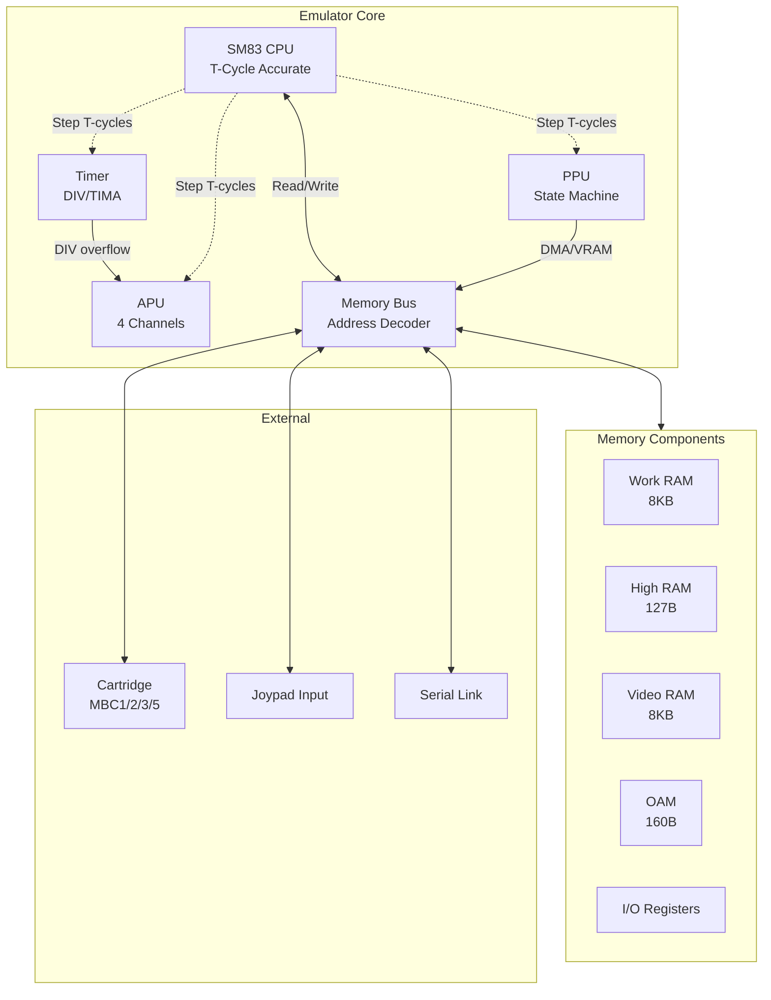
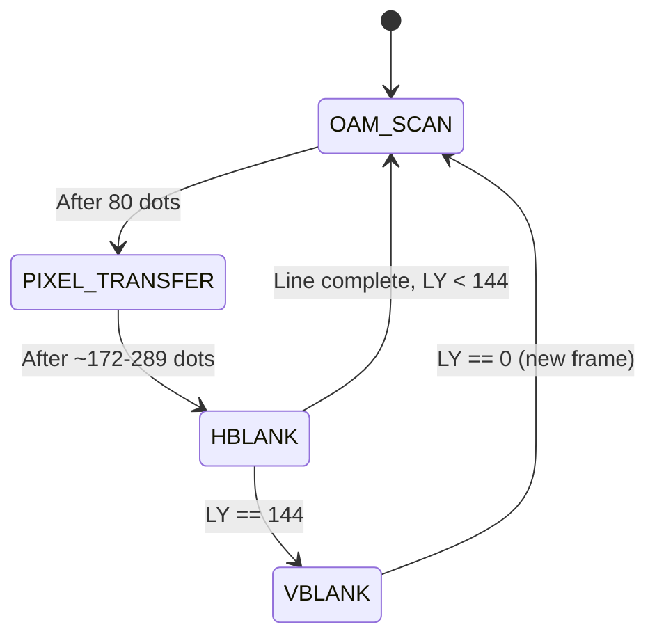

# Hardware-Accurate DMG Emulator Implementation Plan

A comprehensive guide to building a cycle-accurate Game Boy (DMG) emulator with T-cycle counting and a state machine PPU.

---

## Architecture Overview



---

## Proposed Project Structure

```
gb-emu3/
├── CMakeLists.txt              # Build configuration
├── src/
│   ├── main.cpp                # Entry point
│   ├── Emulator.hpp/cpp        # Main emulator orchestration
│   │
│   ├── cpu/
│   │   ├── CPU.hpp/cpp         # SM83 CPU core
│   │   ├── Instructions.hpp    # Opcode definitions
│   │   └── Disassembler.hpp    # Debug disassembly
│   │
│   ├── ppu/
│   │   ├── PPU.hpp/cpp         # State machine PPU
│   │   ├── Fetcher.hpp/cpp     # Pixel FIFO & fetcher
│   │   └── Renderer.hpp/cpp    # Scanline rendering
│   │
│   ├── apu/
│   │   ├── APU.hpp/cpp         # Audio processing unit
│   │   ├── Channel1.hpp/cpp    # Pulse + sweep
│   │   ├── Channel2.hpp/cpp    # Pulse
│   │   ├── Channel3.hpp/cpp    # Wave
│   │   └── Channel4.hpp/cpp    # Noise
│   │
│   ├── memory/
│   │   ├── Bus.hpp/cpp         # Address decoding
│   │   ├── Memory.hpp/cpp      # RAM regions
│   │   └── DMA.hpp/cpp         # OAM DMA
│   │
│   ├── cartridge/
│   │   ├── Cartridge.hpp/cpp   # Cart loading/header
│   │   ├── MBC.hpp             # MBC interface
│   │   ├── NoMBC.hpp/cpp       # ROM-only
│   │   ├── MBC1.hpp/cpp        # MBC1 mapper
│   │   ├── MBC2.hpp/cpp        # MBC2 mapper
│   │   ├── MBC3.hpp/cpp        # MBC3 + RTC
│   │   └── MBC5.hpp/cpp        # MBC5 mapper
│   │
│   ├── timer/
│   │   └── Timer.hpp/cpp       # DIV/TIMA timing
│   │
│   ├── input/
│   │   └── Joypad.hpp/cpp      # Button input
│   │
│   └── frontend/
│       ├── Window.hpp/cpp      # SDL2 window
│       ├── Audio.hpp/cpp       # SDL2 audio
│       └── Input.hpp/cpp       # SDL2 input
│
├── tests/
│   ├── roms/                   # Test ROMs (gitignored)
│   └── test_runner.cpp         # Automated test runner
│
└── docs/
    └── TECHNICAL.md            # Implementation notes
```

---

## Core Components

### 1. CPU (SM83) - T-Cycle Accurate

The Game Boy uses a Sharp SM83 CPU (often incorrectly called "Z80-like"). T-cycle accuracy is **critical** for passing timing tests.

#### Key Design Decisions

| Aspect | Approach | Rationale |
|--------|----------|-----------|
| **Timing Unit** | T-cycles (not M-cycles) | 4 T-cycles = 1 M-cycle. PPU needs T-cycle granularity |
| **Instruction Execution** | Deferred timing pattern | Accumulate pending cycles, flush before memory access |
| **Memory Access** | `cycle_read()` / `cycle_write()` | Every memory access advances PPU/Timer by 4 T-cycles |

#### Pending Cycles Pattern (SameBoy-style)

```cpp
class CPU {
    uint8_t pending_cycles = 0;  // Accumulated but not yet executed
    
    void FlushCycles() {
        while (pending_cycles >= 4) {
            ppu->Step(4);
            timer->Step(4);
            apu->Step(4);
            pending_cycles -= 4;
        }
    }
    
    uint8_t Read(uint16_t addr) {
        FlushCycles();          // Execute pending work first
        pending_cycles = 4;     // This read takes 4 T-cycles
        return bus->Read(addr);
    }
    
    void Write(uint16_t addr, uint8_t value) {
        FlushCycles();
        pending_cycles = 4;
        bus->Write(addr, value);
    }
};
```

#### Instruction Set Implementation

- **256 base opcodes** + **256 CB-prefixed opcodes**
- Use a function pointer table or switch-case
- Each instruction must account for exact T-cycle timing
- Handle HALT bug, interrupt timing, and edge cases

| Instruction Type | Typical T-cycles |
|-----------------|-----------------|
| NOP | 4 |
| LD r, r | 4 |
| LD r, (HL) | 8 |
| LD (HL), r | 8 |
| LD r, n | 8 |
| JP nn | 16 |
| CALL nn | 24 |
| RET | 16 |
| CB prefix | +4 base |

---

### 2. PPU - State Machine Architecture

> [!IMPORTANT]
> The PPU is the most complex component. A proper state machine is required for timing-sensitive games and tests.

#### PPU States (Modes)



| Mode | Duration (dots) | STAT bits | Description |
|------|-----------------|-----------|-------------|
| **Mode 2** (OAM Scan) | 80 | 10 | Search OAM for sprites on current line |
| **Mode 3** (Pixel Transfer) | 172-289 | 11 | Transfer pixels to LCD |
| **Mode 0** (HBlank) | 87-204 | 00 | Horizontal blank |
| **Mode 1** (VBlank) | 4560 | 01 | Vertical blank (10 lines) |

#### Pixel FIFO Architecture

```cpp
struct PixelFIFO {
    std::deque<Pixel> fifo;   // Max 16 pixels
    
    struct Pixel {
        uint8_t color;        // 0-3
        uint8_t palette;      // BGP, OBP0, OBP1
        uint8_t priority;     // BG priority flag
        bool is_sprite;
    };
};

class Fetcher {
    enum State {
        FETCH_TILE_NO,        // 2 dots
        FETCH_TILE_DATA_LOW,  // 2 dots  
        FETCH_TILE_DATA_HIGH, // 2 dots
        PUSH_TO_FIFO          // 2 dots (if space)
    };
    
    State state = FETCH_TILE_NO;
    uint8_t dots = 0;
    
    void Step();  // Called each dot
};
```

#### STAT Interrupt Timing

Critical for tests like `stat_irq_blocking`:

- Mode transitions trigger STAT interrupts
- LY=LYC comparison happens at specific times
- Mode 2 interrupt has ~1 T-cycle delay quirk

---

### 3. Memory Bus

#### Address Map

| Range | Size | Description |
|-------|------|-------------|
| `$0000-$3FFF` | 16KB | ROM Bank 00 (fixed) |
| `$4000-$7FFF` | 16KB | ROM Bank 01-NN (switchable) |
| `$8000-$9FFF` | 8KB | Video RAM |
| `$A000-$BFFF` | 8KB | External RAM (cartridge) |
| `$C000-$DFFF` | 8KB | Work RAM |
| `$E000-$FDFF` | - | Echo RAM (mirror of WRAM) |
| `$FE00-$FE9F` | 160B | OAM (Sprite Attributes) |
| `$FEA0-$FEFF` | - | Unusable |
| `$FF00-$FF7F` | 128B | I/O Registers |
| `$FF80-$FFFE` | 127B | High RAM (HRAM) |
| `$FFFF` | 1B | Interrupt Enable |

#### I/O Register Implementation

```cpp
class Bus {
    uint8_t Read(uint16_t addr) {
        switch (addr) {
            case 0xFF00: return joypad->Read();
            case 0xFF04: return timer->ReadDIV();
            case 0xFF05: return timer->ReadTIMA();
            case 0xFF40: return ppu->ReadLCDC();
            case 0xFF41: return ppu->ReadSTAT();
            case 0xFF44: return ppu->ReadLY();
            // ... more registers
        }
    }
};
```

---

### 4. Timer

The timer is deceptively complex and affects many timing-sensitive games.

```cpp
class Timer {
    uint16_t div_counter = 0;   // Internal 16-bit counter
    uint8_t tima = 0;           // Timer counter
    uint8_t tma = 0;            // Timer modulo
    uint8_t tac = 0;            // Timer control
    
    bool overflow_pending = false;
    uint8_t overflow_cycles = 0;
    
    void Step(uint8_t cycles) {
        uint16_t old_div = div_counter;
        div_counter += cycles;
        
        // DIV is upper 8 bits
        // TIMA increments on falling edge of selected bit
        if (TimerEnabled()) {
            uint16_t bit = GetTimerBit();
            if ((old_div & bit) && !(div_counter & bit)) {
                if (++tima == 0) {
                    // Overflow! Reload after 4 cycles
                    overflow_pending = true;
                    overflow_cycles = 4;
                }
            }
        }
    }
};
```

#### DIV-APU Relationship

- DIV bit 4 (512 Hz) clocks the frame sequencer
- APU length counters, envelope, sweep depend on this

---

### 5. APU (Audio Processing Unit)

Four channels mixed together:

| Channel | Type | Features |
|---------|------|----------|
| CH1 | Pulse | Sweep, envelope, duty |
| CH2 | Pulse | Envelope, duty (no sweep) |
| CH3 | Wave | 4-bit wave samples |
| CH4 | Noise | LFSR, envelope |

#### Frame Sequencer (512 Hz from DIV)

```
Step  Length  Envelope  Sweep
0     Clock   -         -
1     -       -         -
2     Clock   -         Clock
3     -       -         -
4     Clock   -         -
5     -       -         -
6     Clock   -         Clock
7     -       Clock     -
```

---

### 6. Cartridge & MBC Support

| MBC Type | Features | Games |
|----------|----------|-------|
| No MBC | ROM only, up to 32KB | Tetris |
| MBC1 | Up to 2MB ROM, 32KB RAM | Zelda, Pokemon Red/Blue |
| MBC2 | 256KB ROM, 512×4 bit RAM | Kirby |
| MBC3 | 2MB ROM, 32KB RAM, RTC | Pokemon Gold/Silver |
| MBC5 | 8MB ROM, 128KB RAM | Pokemon Crystal |

---

## Implementation Order

> [!TIP]
> Build incrementally, testing each component before moving to the next.

### Phase 1: Minimal Boot (1-2 weeks)
1. **Project setup** - CMake, SDL2, basic window
2. **Memory** - Bus, RAM regions, ROM loading
3. **CPU** - Core loop, registers, basic instructions
4. **Minimal PPU** - Just enough to see output

### Phase 2: Playable (1-2 weeks)
5. **Complete CPU** - All instructions, interrupts
6. **Timer** - DIV, TIMA, TAC
7. **Joypad** - Input handling
8. **Basic MBC1** - Bank switching

### Phase 3: Accurate PPU (2-3 weeks)
9. **State Machine PPU** - All modes, FIFO
10. **Sprites** - OAM scan, sprite rendering
11. **Window** - Window layer handling
12. **STAT interrupts** - Proper timing

### Phase 4: Polish (1-2 weeks)
13. **APU** - All four channels
14. **More MBCs** - MBC2, MBC3 (RTC), MBC5
15. **Save states** - Battery saves

---

## Verification Plan

### Automated Tests

#### Blargg Test ROMs
```bash
# CPU instruction tests (essential first step)
./gb-emu3 --headless --cycles 30000000 tests/roms/blargg/cpu_instrs/cpu_instrs.gb

# Expected: All 11 sub-tests pass
# Individual tests: 01-special, 02-interrupts, 03-op sp,hl, etc.

# Instruction timing
./gb-emu3 --headless --cycles 30000000 tests/roms/blargg/instr_timing/instr_timing.gb

# Memory timing  
./gb-emu3 --headless --cycles 30000000 tests/roms/blargg/mem_timing/mem_timing.gb

# DMG Sound tests
./gb-emu3 --headless --cycles 50000000 tests/roms/blargg/dmg_sound/dmg_sound.gb
```

#### Mooneye Test ROMs
```bash
# Run Mooneye test suite (stricter timing requirements)
./tests/mooneye_runner.sh

# Key tests to watch:
# - acceptance/timer/           # Timer accuracy
# - acceptance/ppu/             # PPU timing
# - acceptance/interrupts/      # Interrupt timing
# - acceptance/bits/            # MBC RAM enable
```

#### Test Runner Implementation
```cpp
// Headless mode for automated testing
int main(int argc, char** argv) {
    if (args.headless) {
        while (cycles < max_cycles) {
            emulator.Step();
            
            // Check for test ROM magic signature
            // Blargg ROMs write to serial: $81 = pass, $80 = fail
            if (serial_output_complete) {
                return parse_result();
            }
        }
    }
}
```

### Manual Verification
1. **Visual Tests**: Run known games, verify graphics match reference screenshots
2. **Audio Tests**: Compare waveform output to known-good recordings
3. **Input Tests**: Verify joypad responsiveness in games
4. **Save Tests**: Verify battery-backed saves persist correctly

---

## Technical References

| Resource | URL | Use |
|----------|-----|-----|
| Pan Docs | https://gbdev.io/pandocs/ | Primary reference |
| GBEDG | https://hacktix.github.io/GBEDG/ | PPU deep dive |
| SameBoy | https://github.com/LIJI32/SameBoy | Reference implementation |
| Mooneye GB | https://github.com/Gekkio/mooneye-gb | Test ROMs |
| Blargg Tests | - | CPU/timing tests |

---

## Next Steps After Approval

1. Set up CMake build system with SDL2 dependency
2. Implement basic project structure with stub files
3. Begin CPU implementation with opcode table
4. Create minimal Bus for testing CPU instructions
5. Iterate with Blargg `cpu_instrs` test as first milestone
